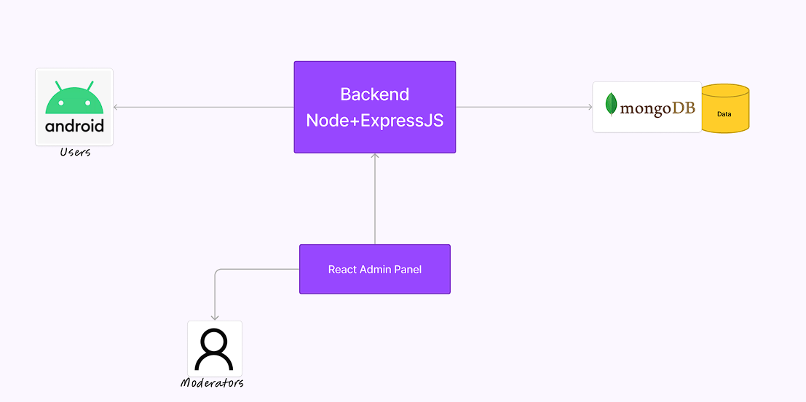
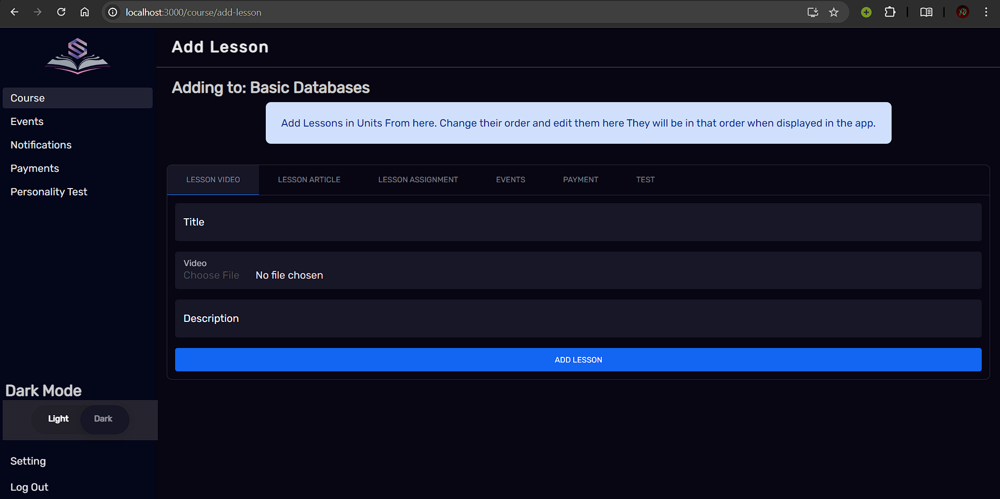

# EDUCATION APP FOR EVERYONE
https://quasar-edtech-admin.netlify.app/

## Description
A simple Full stack application that allows users to create, read, update and delete educational resources. 

Users can access content on android, moderators can use react admin panel to manage content and upload lessons and courses on the app. 

## Features
### Create, Read, Update and Delete lessons 
Lesson contain: a video in multiple qualities, articles, assignements, evenets, checkpoint payments, and tests.

### Add events to the app based on the lesson
Can be a meet link or offline

### A seperate personality test for users which helps to better form the lesson

## Architecture

## Tech Stack
- React
- Node.js
- Express
- MongoDB
- Android

# ScreenShots

## Admin Panel

## Android App

.jpg>) .jpg>) .jpg>) .jpg>) .jpg>) .jpg>)

Note: 
This is the source code for admin panel only. Android app and backend are here respectively.